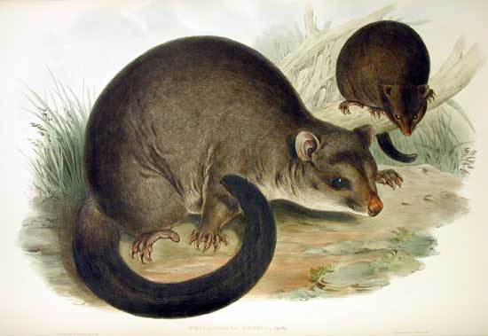

# Challenge graphiques

Ceci est un challenge à relever de manière **individuelle**. Vous avez un jeu de données et 20 graphiques à reproduire à l'identique en un temps limité. Chaque graphique que vous réalisez est comparé pixel pour pixel à la figure de référence. Si la correspondance est parfaite, vous recevez un score de 1, si elle est partielle, le score diminue. Pour tout graphique non réalisé, le score est de zéro. Le score maximum est donc de 20/20.

Vous devez compiler le rapport `challenge_graphiques.qmd` à l'aide du **bouton Rendu** après avoir créé vos graphiques pour que votre score soit calculé (faites bien attention au **nom du chunk** qui doit être `chartXX` où `XX` est le numéro du graphique correspondant). Un fichier est alors généré dans le dossier `results` (à chaque compilation, un nombre est incrémenté). Vous devez soumettre le dernier fichier de `results` dans l'application du challenge à l'adresse <https://sdd.umons.ac.be/A04Ca_charts> pour entrer dans le classement. À ce moment-là, votre position dans le classement global est recalculé. *Vous ne devez pas générer tous les graphiques, ni les générer dans l'ordre pour soumettre une réponse.*. Il suffit d'un graphique pour pouvoir déjà faire une soumission.

**Votre objectif est de monter le plus haut possible dans le classement dans le laps de temps imparti.** Notez que vous pouvez soumettre autant de résultats que vous voulez. Vous ne devez pas attendre d'avoir fini tous les graphiques pour vous classer, et *c'est même mieux de soumettre régulièrement votre progression pour voir où vous vous situez* par rapport aux autres concurrents. À chaque fois que vous soumettez une réponse, vous devez également **effectuer un commit** où vous indiquer dans le message du commit le numéro qui se trouve à la fin du dernier fichier du dossier `results`.

## Les données

Le jeu de données à partir duquel vous réaliserez vos graphiques concerne l'étude de deux populations du phalanger des montagnes, une espèce d'opossum des montagnes australiennes *Trichosurus caninus* Ogilby (*Phalangeridae*: *Marsupiala*) qui a été capturé et mesuré à partir de sept sites différents. Ce jeu de données provient du package {DAAG}.

Les variables sont :

-   `site`, le site de récolte (il y en a sept différents)
-   `Pop` la population d'origine `Vic` pour victoria, ou `other` pour les autres sites
-   `sex`, le sexe `m` pour mâle et `f` pour femelle
-   `age`, l'âge de l'animal en années
-   `hdlngth`, la longueur de la tête en mm
-   `skullw`, la largeur du crâne en mm
-   `totlngth`, la taille totale en cm
-   `taill`, la taille de la queue en cm
-   `footlgth`, la taille des pattes en mm
-   `earconch`, la dimension du cartilage de l'oreille en mm
-   `eye`, la taille de l'oeil en mm
-   `chest`, la circonférence de la poitrine en cm
-   `belly`, la circonférence du ventre en cm

Les 20 graphiques que vous devez réaliser sont du même type que ceux présentés dans les modules 2 à 4 du cours de Science des Données 1: visualisation, voir <https://wp.sciviews.org/sdd-umons/?iframe=wp.sciviews.org/sdd-umons-2023/visu1.html>.

**Que le meilleur gagne !**
